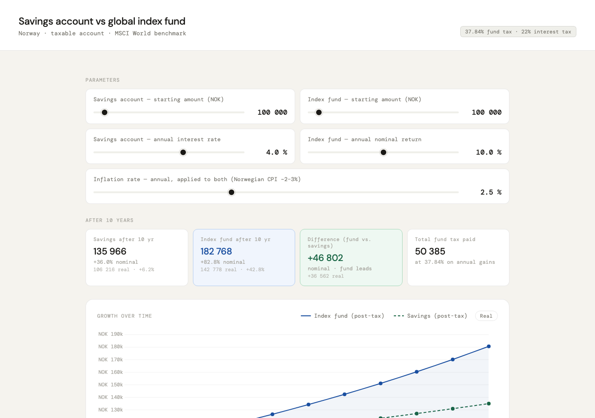

# Savings account vs index fund — Norway

Interactive calculator comparing a savings account against a global index fund under Norwegian tax rules.

**[superelectric.net/finance](http://superelectric.net/finance)**

## Tax model

| Instrument | Rate | Basis |
|---|---|---|
| Savings interest | 22% | Annual (kapitalinntekt) |
| Index fund gains | 37.84% | Annual realized gains (22% x oppjusteringsfaktor 1.72) |

A regular taxable account is modelled, not ASK (aksjesparekonto). ASK defers tax until withdrawal and would show an even larger fund advantage.

## Features

- Adjustable starting amounts, interest/return rates, and inflation rate
- Real (inflation-adjusted) values alongside nominal in metrics and table
- Nominal/real toggle on the chart
- Year-by-year breakdown table

## Sources

- [Kapitalinntekt — Skatteetaten](https://www.skatteetaten.no/person/skatt/hjelp-til-riktig-skatt/bank-og-finans/renter/)
- [Oppjusteringsfaktor — Skatteetaten](https://www.skatteetaten.no/satser/oppjusteringsfaktor/)
